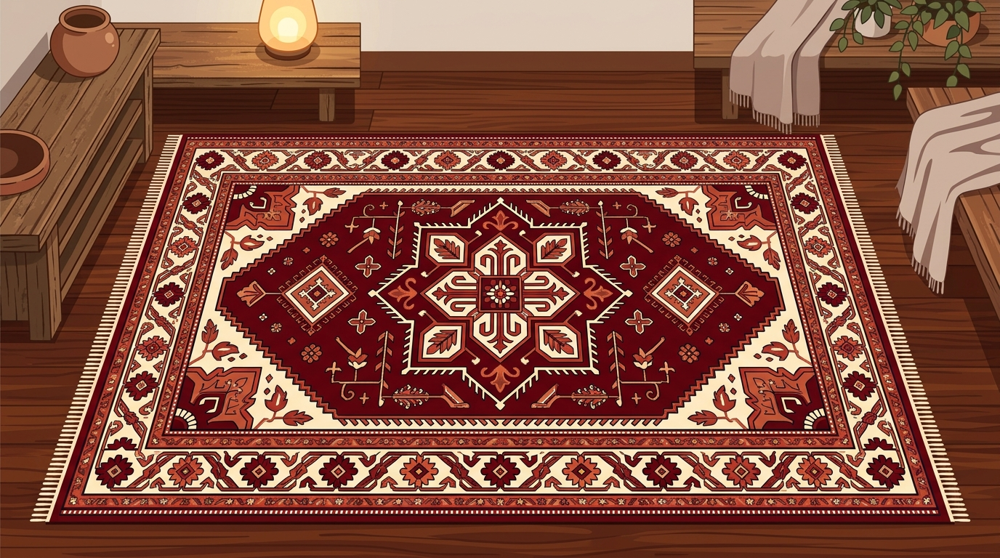

<div align="center">
  
  <br/><br/>
  <h1 dir="rtl">نقشه‌خوان فرش</h1>
  <h3 dir="rtl">Carpet Map Reader</h3>
  <p dir="rtl">
    <strong>یک ابزار هوشمند برای قالی‌بافان — تبدیل نقشه‌های فرش به صدای گویا</strong>
    <br/>
    <em>An intelligent tool for carpet weavers — turn carpet maps into spoken audio</em>
  </p>
  <p>
    
    
    
    
    
    
  </p>
</div>

---

**Carpet Map Reader** helps carpet weavers read traditional Persian maps using OCR (ML Kit), Gemini AI, and Persian TTS — scanning grid patterns and speaking each cell aloud.

> **نقشه‌خوان فرش** با استفاده از OCR و گفتار متنی، نقشه‌های فرش را می‌خواند و هر خانه را به فارسی گویا می‌کند.

---

## Features

- **📸 Scan** — Take/import a carpet map photo
- **🧠 AI OCR** — Number recognition via ML Kit & Gemini AI
- **🎤 Persian TTS** — Natural spoken output with 65+ MP3 audio files
- **🎨 Color Detection** — Identifies dominant carpet colors per cell
- **🗂️ Projects** — Save/load multiple maps with auto-resume
- **🧭 Directions** — RTL, LTR, ZIGZAG traversal patterns
- **📐 Map Types** — GRID (standard) / NUMERICAL (color-code with sections)

## Tech Stack

Kotlin · Jetpack Compose + Material 3 · MVVM · Room · ML Kit · Firebase Gemini AI · Retrofit · Moshi · Coil · Gradle 9.3 / AGP 9.1

## Project Structure

```
app/src/main/java/com/farsh/carpetmapreader/
├── MainActivity.kt
├── ui/          CarpetApp.kt, CarpetViewModel.kt, theme/
├── processor/   ReaderEngine, OCR, GridDetector, NumericalParser, TTS, AudioPlayer
└── data/        AppDatabase, MapDao, MapProject, MapCell, MapRepository
```

## License

```
MIT License — Copyright (c) 2026 Farshid
```

---

<div align="center" dir="rtl">
  <sub>ساخته شده با ❤️ برای قالی‌بافان ایران</sub>
  <br/>
  <sub>Made with ❤️ for Iranian carpet weavers</sub>
</div>
